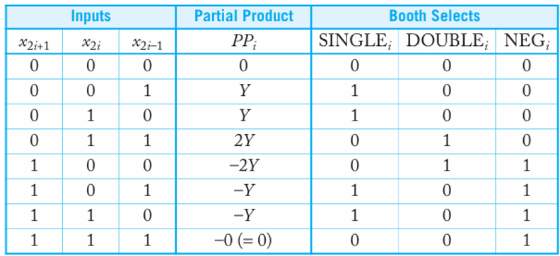
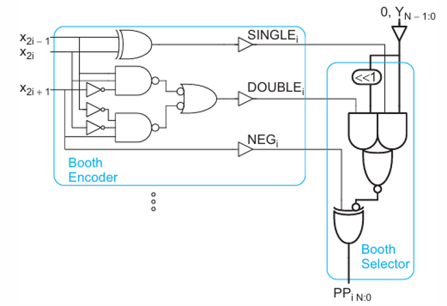
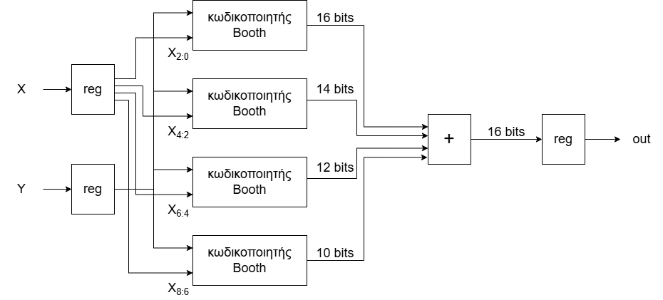
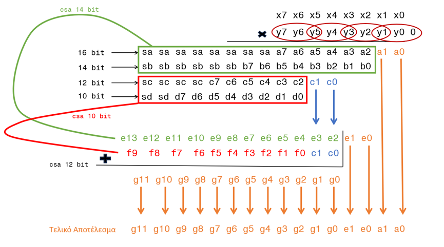
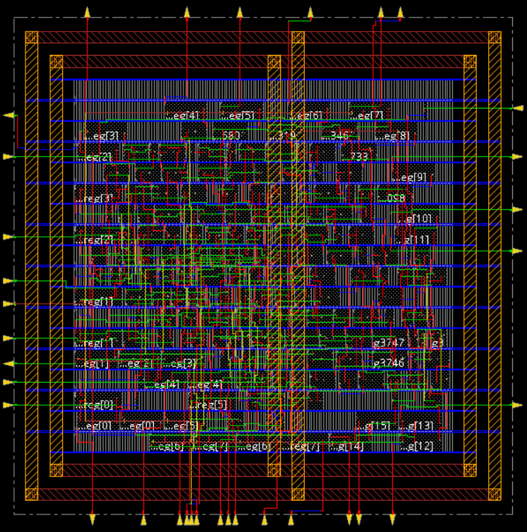

# 8-bit Radix-4 Booth Multiplier

A fully **structural VHDL** implementation of an 8×8-bit radix-4 Booth multiplier, synthesized with **Cadence Genus** (45 nm and 7 nm) and placed & routed with **Cadence Innovus**.

---

## Overview

A naive radix-2 multiplier of two 8-bit numbers needs 8 partial products. Radix-4 Booth encoding cuts that to **4**, at the cost of needing "hard multiples" like `3Y`. Booth's trick avoids computing `3Y` directly (which would need a slow carry-propagate adder) by instead expressing it as `4Y - Y`: one partial product becomes `-Y` and the next (weighted by 4) absorbs a `+Y` correction.

This project implements that scheme end to end:

1. **Booth encoding** — recode the multiplier into `SINGLE` / `DOUBLE` / `NEG` control signals per bit-triplet
2. **Partial product generation** — 4 sign-extended partial products (16/14/12/10 bits)
3. **Partial product addition** — a parallel Carry-Select Adder tree tuned for minimum critical path
4. **Top level** — input/output registers around the multiplier core

---

## Architecture

### 1. Booth Recoding

Each triplet `(x₂ᵢ₊₁, x₂ᵢ, x₂ᵢ₋₁)` of the multiplicand selects a partial product according to the standard radix-4 modified Booth table:


*Figure 1: Booth encoding truth table (Source: N. Weste & D. Harris, CMOS VLSI Design).*

### 2. Booth Encoder & Selector (gate level)

`boothencoder` derives the `SINGLE`/`DOUBLE`/`NEG` control bits from a triplet; `boothselector` uses them to pick `0`, `Y`, or `2Y` (via a `<<1` shift) and conditionally complements it:


*Figure 2: Booth Encoder and Selector architecture (Source: N. Weste & D. Harris, CMOS VLSI Design).*

### 3. Partial Product Generation

`X` and `Y` are registered, `X` is split into 4 overlapping triplets, and each Booth encoder produces one sign-extended partial product:


*Figure 3: Complete block diagram*

### 4. Partial Product Addition

To minimize delay, the four partial products are combined with a parallel tree of Carry-Select Adders — 14-bit and 10-bit adders run in parallel, then a final 12-bit adder merges the results. Bits that have no contending row (`a0`, `a1`, `e0`, `e1`, ...) skip the adder tree entirely and pass straight through:


*Figure 4: Addition logic*

---

## Repository Structure

```
booth-multiplier-8bit/
├── vhdl/
│   ├── boothencoder.vhd            -- 1-bit Booth encoder (SINGLE/DOUBLE/NEG)
│   ├── boothselector.vhd           -- 1-bit Booth selector (produces one PP bit)
│   ├── boothcomplete.vhd           -- 8-bit PP row (encoder + 8 selectors + correction adder)
│   ├── ppgenerator.vhd             -- all 4 partial product rows
│   ├── fulladder.vhd               -- 1-bit full adder
│   ├── adder.vhd                   -- generic n-bit ripple-carry adder
│   ├── mux2to1.vhd                 -- 1-bit 2:1 mux
│   ├── muxnbit.vhd                 -- generic n-bit 2:1 mux
│   ├── csa_gen10and14bit.vhd       -- generic Carry-Select Adder (2-bit blocks)
│   ├── csa_gen12bit.vhd            -- generic Carry-Select Adder (4-bit blocks)
│   ├── partialproductadder.vhd     -- combines the 4 partial products
│   ├── boothmultiplier.vhd         -- ppgenerator + partialproductadder
│   ├── QD.vhd                      -- generic n-bit register
│   └── project.vhd                 -- top level (registers + boothmultiplier)
├──anafora.pdf                 -- full project report (VHDL + synthesis results)
├──Booth_Multiplier_Presentation.pdf
├── readme_assets/                  -- diagrams used in this README
└── README.md
```

---

## Module Reference

| File | Role |
|---|---|
| `boothencoder.vhd` | Recodes a 3-bit triplet into `SINGLE`, `DOUBLE`, `NEG` |
| `boothselector.vhd` | Produces one partial-product bit from two adjacent multiplicand bits + control signals |
| `boothcomplete.vhd` | Full 8-bit partial product row; folds in the two's-complement `+1` correction internally |
| `ppgenerator.vhd` | Instantiates the 4 partial-product rows for an 8×8 multiply |
| `fulladder.vhd` / `adder.vhd` | 1-bit and generic n-bit ripple-carry adders |
| `mux2to1.vhd` / `muxnbit.vhd` | 2:1 multiplexers, used inside the Carry-Select adders |
| `csa_gen10and14bit.vhd` | Generic Carry-Select Adder, 2-bit blocks (used for the 14-bit and 10-bit sums) |
| `csa_gen12bit.vhd` | Generic Carry-Select Adder, 4-bit blocks (used for the final 12-bit sum) |
| `partialproductadder.vhd` | Aligns and sums the 4 partial products into the 16-bit product |
| `boothmultiplier.vhd` | Combinational Booth multiplier core (`ppgenerator` + `partialproductadder`) |
| `QD.vhd` | Generic n-bit register, used for I/O pipelining |
| `project.vhd` | Top-level entity: input/output registers wrapped around `boothmultiplier` |

---

## Synthesis Results (Cadence Genus)

| Metric | 45 nm | 7 nm |
|---|---|---|
| Clock period | 5.000 ns | 0.705 ns |
| Critical path | 4.861 ns | 0.684 ns |
| Slack | 13 ps | 2 ps |
| Cell count | 208 | 405 |
| Total area | 946.951 µm² | 42.049 µm² |
| Power | 207.79 µW | 211.14 µW |

As expected from technology scaling: **~7× faster** critical path and **~22× smaller** area at 7 nm, with power roughly flat (smaller devices offset by higher leakage density at 7 nm).

### Layout (Innovus, 45 nm)


*Figure 5: 45nm layout*

I/O pads follow the tool's optimal placement; clock tree synthesis (CTS) was applied for uniform clock distribution.

---

## References
The theoretical background, truth tables, and architectural diagrams used in this project are based on the following literature:
N. Weste and D. Harris, *"CMOS VLSI Design: A Circuits and Systems Perspective,"* 3rd Edition, Pearson Addison Wesley, Boston, 2005.
